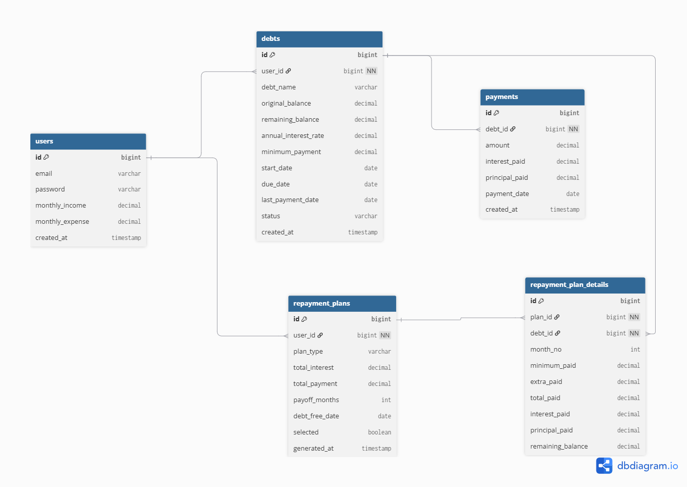

# Database Design — DebtWizard

## Sơ đồ quan hệ thực thể (ERD)

---

# Quan hệ giữa các bảng

| Quan hệ | Loại | Mô tả |
|---------|------|-------|
| `users` → `debts` | 1:N | Một user có nhiều khoản nợ |
| `debts` → `payments` | 1:N | Một khoản nợ có nhiều lần thanh toán thực tế |
| `users` → `refresh_token` | 1:1 | Mỗi user có tối đa một refresh token hiện hành |
| `users` → `saved_plans` | 1:1 | Mỗi user lưu tối đa một kế hoạch trả nợ tại một thời điểm |
| `saved_plans` → `plan_monthly_schedules` | 1:N | Một kế hoạch có nhiều tháng thanh toán dự kiến |
| `plan_monthly_schedules` → `plan_debt_payments` | 1:N | Mỗi tháng có phân bổ thanh toán chi tiết cho từng khoản nợ |
| `debts` → `plan_debt_payments` | 1:N | Một khoản nợ có thể xuất hiện trong nhiều tháng của kế hoạch |

---

## Mô tả chi tiết từng bảng

### 1. `users`

Lưu thông tin tài khoản và tài chính của người dùng.

| Cột | Kiểu | Ràng buộc | Mô tả |
|-----|------|-----------|-------|
| `id` | BIGINT | PK, AUTO_INCREMENT | Khóa chính |
| `username` | VARCHAR(50) | NOT NULL, UNIQUE | Tên đăng nhập |
| `email` | VARCHAR(100) | UNIQUE, nullable | Email người dùng |
| `password` | VARCHAR | NOT NULL | Mật khẩu đã được BCrypt hash |
| `full_name` | VARCHAR(100) | NOT NULL | Họ và tên |
| `monthly_income` | DECIMAL(15,2) | nullable, default 0 | Thu nhập hàng tháng |
| `monthly_expense` | DECIMAL(15,2) | nullable, default 0 | Chi tiêu cố định hàng tháng |
| `created_at` | TIMESTAMP | NOT NULL, immutable | Thời điểm tạo tài khoản |
| `updated_at` | TIMESTAMP | NOT NULL | Thời điểm cập nhật gần nhất |

---

### 2. `debts`

Lưu thông tin từng khoản nợ. Các trường tài chính cốt lõi (`totalPrincipal`, `termMonths`, `interestRate`) không thể thay đổi sau khi tạo, chỉ `lenderName` được phép update.

| Cột | Kiểu | Ràng buộc | Mô tả |
|-----|------|-----------|-------|
| `id` | BIGINT | PK, AUTO_INCREMENT | Khóa chính |
| `user_id` | BIGINT | NOT NULL, FK → `users.id` | Chủ sở hữu khoản nợ |
| `lender_name` | VARCHAR | NOT NULL | Tên bên cho vay |
| `total_principal` | DECIMAL(15,2) | NOT NULL | Nợ gốc ban đầu |
| `remaining_principal` | DECIMAL(15,2) | NOT NULL | Nợ gốc còn lại, default = `total_principal` |
| `expected_monthly_payment` | DECIMAL(15,2) | NOT NULL | Số tiền phải trả tối thiểu mỗi tháng (tính theo công thức khi tạo) |
| `term_months` | INTEGER | NOT NULL | Kỳ hạn vay (tháng) |
| `start_date` | DATE | NOT NULL | Ngày bắt đầu khoản nợ |
| `due_day` | INTEGER | NOT NULL | Ngày đến hạn thanh toán trong tháng (1–31) |
| `next_due_date` | DATE | NOT NULL | Ngày đến hạn thanh toán tiếp theo |
| `last_payment_date` | DATE | nullable | Ngày thanh toán thực tế gần nhất |
| `last_interest_accrued_date` | DATE | NOT NULL | Ngày cuối đã tính lãi, dùng cho accrual hàng ngày |
| `accrued_interest` | DECIMAL(15,2) | NOT NULL, default 0 | Lãi đã phát sinh nhưng chưa thanh toán |
| `status` | VARCHAR | NOT NULL | Trạng thái: `ACTIVE` / `OVERDUE` / `PAID_OFF` |
| `debt_type` | VARCHAR | NOT NULL | Loại nợ: `BANKING` / `PERSONAL_LOAN` / `CREDIT` |
| `deleted` | BOOLEAN | NOT NULL, default false | Soft-delete flag |
| `paid_off_at` | TIMESTAMP | nullable | Thời điểm tất toán khoản nợ |
| `created_at` | TIMESTAMP | NOT NULL, immutable | Thời điểm tạo |
| `updated_at` | TIMESTAMP | NOT NULL | Thời điểm cập nhật gần nhất |
| `interest_calculation_method` | VARCHAR | NOT NULL (embedded) | Phương pháp tính lãi: `FLAT` / `REDUCING_BALANCE` |
| `interest_frequency` | VARCHAR | NOT NULL (embedded) | Tần suất tính lãi: `DAILY` / `MONTHLY` / `ANNUALLY` |
| `interest_rate` | DECIMAL(8,2) | NOT NULL (embedded) | Lãi suất năm (%, ví dụ: 12.0 = 12%/năm) |

> **Lưu ý:** `interest_calculation_method`, `interest_frequency`, `interest_rate` là các cột của `InterestSettings` được nhúng trực tiếp vào bảng `debts` qua `@Embeddable` — không tạo bảng riêng.

---

### 3. `payments`

Lưu lịch sử các lần thanh toán thực tế của người dùng cho từng khoản nợ.

| Cột | Kiểu | Ràng buộc | Mô tả |
|-----|------|-----------|-------|
| `id` | BIGINT | PK, AUTO_INCREMENT | Khóa chính |
| `debt_id` | BIGINT | NOT NULL, FK → `debts.id` | Khoản nợ được thanh toán |
| `payment_date` | DATE | NOT NULL | Ngày thực hiện thanh toán |
| `amount` | DECIMAL(15,2) | NOT NULL | Tổng số tiền thanh toán |
| `principal_paid` | DECIMAL(15,2) | NOT NULL, default 0 | Phần trả vào nợ gốc |
| `interest_paid` | DECIMAL(15,2) | NOT NULL, default 0 | Phần trả vào lãi (interest-first) |
| `payment_method` | VARCHAR | NOT NULL | Phương thức: `CASH` / `BANK_TRANSFER` / `E_WALLET` / `CREDIT_CARD` |
| `note` | VARCHAR(255) | nullable | Ghi chú của người dùng |
| `created_at` | TIMESTAMP | NOT NULL, immutable | Thời điểm ghi nhận |
| `updated_at` | TIMESTAMP | NOT NULL | Thời điểm cập nhật gần nhất |

> **Soft-update / Soft-delete:** Hiện tại hệ thống **CHƯA hỗ trợ** cập nhật hoặc xóa payment. Tính năng update (cho phép sửa `note` và `paymentDate`) và delete (soft-delete) được lên kế hoạch trong phiên bản tương lai. Để sửa payment, hiện tại phải xóa và tạo mới.

---

### 4. `refresh_token`

Lưu refresh token cho cơ chế JWT token rotation. Mỗi user chỉ có một token hiện hành — khi refresh, token cũ bị xóa và thay bằng token mới.

| Cột | Kiểu | Ràng buộc | Mô tả |
|-----|------|-----------|-------|
| `id` | BIGINT | PK, AUTO_INCREMENT | Khóa chính |
| `token` | VARCHAR | NOT NULL, UNIQUE | Giá trị refresh token |
| `user_id` | BIGINT | FK → `users.id` | User sở hữu token (1:1) |
| `expiry_date` | TIMESTAMP | NOT NULL | Thời điểm hết hạn token |

---

### 5. `saved_plans`

Lưu kế hoạch trả nợ mà user đã chọn sau khi so sánh. Mỗi user chỉ có tối đa một kế hoạch — save plan mới sẽ replace plan cũ.

| Cột | Kiểu | Ràng buộc | Mô tả |
|-----|------|-----------|-------|
| `id` | BIGINT | PK, AUTO_INCREMENT | Khóa chính |
| `user_id` | BIGINT | NOT NULL, UNIQUE, FK → `users.id` | User sở hữu kế hoạch (1:1) |
| `strategy` | VARCHAR | NOT NULL | Chiến lược: `MINIMIZE_INTEREST` / `IMPROVE_CASHFLOW` |
| `plan_name` | VARCHAR | NOT NULL | Tên hiển thị của chiến lược |
| `monthly_extra_payment` | DECIMAL(15,2) | NOT NULL | Số tiền trả thêm hàng tháng ngoài minimum |
| `total_interest_paid` | DECIMAL(15,2) | NOT NULL | Tổng lãi dự kiến phải trả theo kế hoạch |
| `payoff_duration_months` | INTEGER | NOT NULL | Số tháng dự kiến để trả hết toàn bộ nợ |
| `saved_at` | TIMESTAMP | NOT NULL, immutable | Thời điểm lưu kế hoạch |

---

### 6. `plan_monthly_schedules`

Lưu lịch thanh toán dự kiến theo từng tháng của kế hoạch.

| Cột | Kiểu | Ràng buộc | Mô tả |
|-----|------|-----------|-------|
| `id` | BIGINT | PK, AUTO_INCREMENT | Khóa chính |
| `saved_plan_id` | BIGINT | NOT NULL, FK → `saved_plans.id` | Kế hoạch sở hữu tháng này |
| `month_index` | INTEGER | NOT NULL | Thứ tự tháng trong kế hoạch (bắt đầu từ 1) |
| `date` | DATE | NOT NULL | Ngày dự kiến thanh toán của tháng |
| `total_payment` | DECIMAL(15,2) | NOT NULL | Tổng số tiền thanh toán trong tháng |
| `extra_payment_used` | DECIMAL(15,2) | NOT NULL | Phần extra payment đã dùng trong tháng |
| `cashflow_released` | DECIMAL(15,2) | NOT NULL | Tiền giải phóng từ khoản nợ đã tất toán trong tháng |

---

### 7. `plan_debt_payments`

Lưu chi tiết phân bổ thanh toán cho từng khoản nợ trong mỗi tháng của kế hoạch.

| Cột | Kiểu | Ràng buộc | Mô tả |
|-----|------|-----------|-------|
| `id` | BIGINT | PK, AUTO_INCREMENT | Khóa chính |
| `schedule_id` | BIGINT | NOT NULL, FK → `plan_monthly_schedules.id` | Tháng chứa bản ghi này |
| `debt_id` | BIGINT | NOT NULL, FK → `debts.id` | Khoản nợ được phân bổ |
| `debt_name` | VARCHAR | NOT NULL | Tên khoản nợ được chép lại tại thời điểm lưu kế hoạch |
| `minimum_paid` | DECIMAL(15,2) | NOT NULL | Phần thanh toán tối thiểu |
| `extra_paid` | DECIMAL(15,2) | NOT NULL | Phần thanh toán thêm vào khoản nợ này |
| `principal_paid` | DECIMAL(15,2) | NOT NULL | Phần trả vào gốc |
| `interest_paid` | DECIMAL(15,2) | NOT NULL | Phần trả vào lãi |
| `remaining_balance` | DECIMAL(15,2) | NOT NULL | Dư nợ còn lại sau tháng này |
| `paid_off` | BOOLEAN | NOT NULL | Khoản nợ này được tất toán trong tháng này hay không |

> **Lưu ý thiết kế:** `debt_name` được chép trực tiếp từ `lenderName` tại thời điểm lưu kế hoạch và không thay đổi theo sau đó. Điều này đảm bảo kế hoạch hiển thị đúng tên khoản nợ như lúc user lập kế hoạch, dù user có đổi tên khoản nợ về sau.

---

## Cascade & Xóa dữ liệu

| Hành động | Cascade |
|-----------|---------|
| Xóa `saved_plans` | Cascade xóa toàn bộ `plan_monthly_schedules` liên quan |
| Xóa `plan_monthly_schedules` | Cascade xóa toàn bộ `plan_debt_payments` liên quan |
| Xóa `debts` | Soft-delete (`deleted = true`), không xóa vật lý |
| Xóa `payments` | Soft-delete (`deleted = true`), không xóa vật lý |

> saved_plans và các bảng con dùng hard-delete vì chúng là simulation data — không có giá trị lịch sử cần giữ lại.
