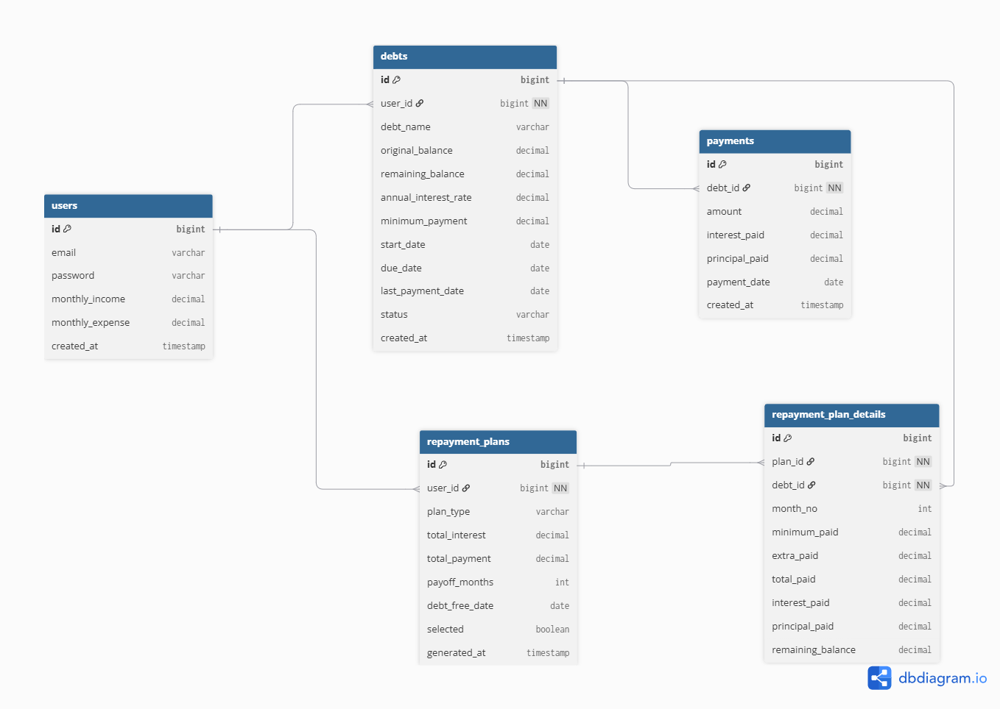

# Database Design — DebtWizard

---

## 1. Sơ đồ Quan hệ Thực thể (ERD)

### Bảng tổng hợp Quan hệ giữa các Thực thể

| Quan hệ | Loại | Khóa ngoại (FK) | Hành vi / Mô tả |
|---|---|---|---|
| `users` → `finance_profiles` | 1:1 | `finance_profiles.user_id` | Mỗi người dùng có một hồ sơ tài chính ghi nhận thu nhập và chi phí thiết yếu. |
| `users` → `refresh_token` | 1:1 | `refresh_token.user_id` | Mỗi người dùng duy trì tối đa 1 refresh token hiện hành (Token Rotation). |
| `users` → `debts` | 1:N | `debts.user_id` | Một người dùng có thể sở hữu nhiều khoản nợ. |
| `debts` → `payments` | 1:N | `payments.debt_id` | Một khoản nợ có nhiều lần ghi nhận thanh toán thực tế. |
| `users` → `notifications` | 1:N | `notifications.user_id` | Một người dùng nhận nhiều thông báo thanh toán và nhắc nợ. |
| `users` → `saved_plans` | 1:1 | `saved_plans.user_id` | Mỗi người dùng lưu tối đa một kế hoạch trả nợ tại một thời điểm. |
| `saved_plans` → `plan_monthly_schedules` | 1:N | `plan_monthly_schedules.saved_plan_id` | Một kế hoạch gồm nhiều tháng thanh toán dự kiến. |
| `plan_monthly_schedules` → `plan_debt_payments` | 1:N | `plan_debt_payments.schedule_id` | Mỗi tháng có bảng phân bổ thanh toán chi tiết cho từng khoản nợ. |
| `debts` → `plan_debt_payments` | 1:N | `plan_debt_payments.debt_id` | Khoản nợ gốc được tham chiếu trong các tháng của kế hoạch. |

---

## 2. Mô tả Chi tiết Schema các Bảng

### 2.1 Bảng `users`
Lưu trữ thông tin tài khoản và thông tin cá nhân của người dùng.

| Cột | Kiểu dữ liệu | Ràng buộc | Mô tả |
|---|---|---|---|
| `id` | BIGINT | PK, AUTO_INCREMENT | Khóa chính |
| `username` | VARCHAR(50) | NOT NULL, UNIQUE | Tên đăng nhập |
| `email` | VARCHAR(100) | UNIQUE, NULLABLE | Địa chỉ email |
| `password` | VARCHAR | NOT NULL | Mật khẩu đã băm (BCrypt Hash) |
| `full_name` | VARCHAR(100) | NOT NULL | Họ và tên đầy đủ |
| `created_at` | TIMESTAMP | NOT NULL, Updatable=false | Thời điểm tạo tài khoản |
| `updated_at` | TIMESTAMP | NOT NULL | Thời điểm cập nhật gần nhất |

---

### 2.2 Bảng `finance_profiles`
Lưu trữ hồ sơ tài chính cơ bản gồm thu nhập và chi tiêu thiết yếu phục vụ cho phân tích DTI và tính toán ngân sách mô phỏng.

| Cột | Kiểu dữ liệu | Ràng buộc | Mô tả |
|---|---|---|---|
| `id` | BIGINT | PK, AUTO_INCREMENT | Khóa chính |
| `user_id` | BIGINT | NOT NULL, UNIQUE, FK → `users.id` | Khóa ngoại trỏ đến người dùng (1:1) |
| `monthly_income` | DECIMAL(15,2) | NOT NULL, DEFAULT 0.00 | Thu nhập cố định hàng tháng |
| `monthly_essential_expenses` | DECIMAL(15,2) | NOT NULL, DEFAULT 0.00 | Chi phí sinh hoạt thiết yếu hàng tháng |
| `created_at` | TIMESTAMP | NOT NULL, Updatable=false | Thời điểm khởi tạo |
| `updated_at` | TIMESTAMP | NOT NULL | Thời điểm cập nhật gần nhất |

---

### 2.3 Bảng `refresh_token`
Quản lý refresh token cho cơ chế JWT Token Rotation.

| Cột | Kiểu dữ liệu | Ràng buộc | Mô tả |
|---|---|---|---|
| `id` | BIGINT | PK, AUTO_INCREMENT | Khóa chính |
| `token` | VARCHAR | NOT NULL, UNIQUE | Chuỗi JWT Refresh Token ngẫu nhiên |
| `user_id` | BIGINT | NOT NULL, FK → `users.id` | Người dùng sở hữu token |
| `expiry_date` | TIMESTAMP | NOT NULL | Thời điểm hết hạn của token |

---

### 2.4 Bảng `debts`
Lưu trữ thông tin chi tiết từng khoản nợ. Cấu hình lãi suất (`InterestSettings`) được nhúng trực tiếp bằng cơ chế `@Embeddable`.

| Cột | Kiểu dữ liệu | Ràng buộc | Mô tả |
|---|---|---|---|
| `id` | BIGINT | PK, AUTO_INCREMENT | Khóa chính |
| `user_id` | BIGINT | NOT NULL, FK → `users.id` | Chủ sở hữu khoản nợ |
| `lender_name` | VARCHAR | NOT NULL | Tên ngân hàng / bên cho vay |
| `total_principal` | DECIMAL(15,2) | NOT NULL | Nợ gốc ban đầu |
| `remaining_principal` | DECIMAL(15,2) | NOT NULL | Nợ gốc còn lại hiện tại |
| `expected_monthly_payment` | DECIMAL(15,2) | NOT NULL, DEFAULT 0.00 | Số tiền thanh toán tối thiểu dự kiến mỗi tháng |
| `term_months` | INTEGER | NOT NULL | Kỳ hạn vay (tháng) |
| `start_date` | DATE | NOT NULL | Ngày bắt đầu khoản nợ |
| `due_day` | INTEGER | NOT NULL | Ngày đến hạn trong tháng (1–31) |
| `next_due_date` | DATE | NOT NULL | Ngày đến hạn thanh toán tiếp theo |
| `last_payment_date` | DATE | NULLABLE | Ngày thanh toán thực tế gần nhất |
| `last_interest_accrued_date` | DATE | NOT NULL | Ngày cuối cùng đã cộng dồn lãi suất |
| `accrued_interest` | DECIMAL(15,2) | NOT NULL, DEFAULT 0.00 | Lãi phát sinh tích lũy chưa thanh toán |
| `status` | VARCHAR(20) | NOT NULL | Trạng thái: `ACTIVE`, `OVERDUE`, `PAID_OFF` |
| `debt_type` | VARCHAR(20) | NOT NULL | Loại nợ: `BANKING`, `PERSONAL_LOAN`, `CREDIT` |
| `interest_calculation_method` | VARCHAR(20) | NOT NULL (Embedded) | Phương pháp tính lãi: `FLAT`, `REDUCING_BALANCE` |
| `interest_frequency` | VARCHAR(20) | NOT NULL (Embedded) | Tần suất tính lãi: `DAILY`, `MONTHLY`, `ANNUALLY` |
| `interest_rate` | DECIMAL(8,2) | NOT NULL (Embedded) | Lãi suất năm (% ví dụ 12.0 = 12%/năm) |
| `deleted` | BOOLEAN | NOT NULL, DEFAULT false | Cờ xóa mềm (Soft delete) |
| `paid_off_at` | TIMESTAMP | NULLABLE | Thời điểm tất toán khoản nợ |
| `created_at` | TIMESTAMP | NOT NULL, Updatable=false | Thời điểm tạo bản ghi |
| `updated_at` | TIMESTAMP | NOT NULL | Thời điểm cập nhật gần nhất |

---

### 2.5 Bảng `payments`
Lưu trữ lịch sử các giao dịch thanh toán thực tế cho từng khoản nợ.

| Cột | Kiểu dữ liệu | Ràng buộc | Mô tả |
|---|---|---|---|
| `id` | BIGINT | PK, AUTO_INCREMENT | Khóa chính |
| `debt_id` | BIGINT | NOT NULL, FK → `debts.id` | Khoản nợ được thanh toán |
| `payment_date` | DATE | NOT NULL | Ngày thực hiện thanh toán |
| `amount` | DECIMAL(15,2) | NOT NULL | Tổng số tiền thanh toán thực tế |
| `principal_paid` | DECIMAL(15,2) | NOT NULL, DEFAULT 0.00 | Số tiền phân bổ vào giảm trừ nợ gốc |
| `interest_paid` | DECIMAL(15,2) | NOT NULL, DEFAULT 0.00 | Số tiền phân bổ vào thanh toán lãi (Interest-first) |
| `payment_method` | VARCHAR(20) | NOT NULL | Phương thức: `CASH`, `BANK_TRANSFER`, `E_WALLET`, `CREDIT_CARD` |
| `note` | VARCHAR(255) | NULLABLE | Ghi chú thêm của người dùng |
| `created_at` | TIMESTAMP | NOT NULL, Updatable=false | Thời điểm ghi nhận giao dịch |
| `updated_at` | TIMESTAMP | NOT NULL | Thời điểm cập nhật |

---

### 2.6 Bảng `notifications`
Lưu trữ thông báo trong ứng dụng (In-app Notifications) và quản lý trạng thái đọc.

| Cột | Kiểu dữ liệu | Ràng buộc | Mô tả |
|---|---|---|---|
| `id` | BIGINT | PK, AUTO_INCREMENT | Khóa chính |
| `user_id` | BIGINT | NOT NULL, FK → `users.id` | Người dùng nhận thông báo |
| `title` | VARCHAR(255) | NOT NULL | Tiêu đề thông báo |
| `message` | VARCHAR(500) | NOT NULL | Nội dung chi tiết thông báo |
| `type` | VARCHAR(50) | NOT NULL | Loại thông báo: `PAYMENT_REMINDER`, `PAYMENT_COMPLETED`, v.v. |
| `is_read` | BOOLEAN | NOT NULL, DEFAULT false | Trạng thái đã đọc |
| `reference_key` | VARCHAR(255) | UNIQUE, NULLABLE | Khóa định danh chống lặp thông báo (Idempotency Key) |
| `deleted` | BOOLEAN | NOT NULL, DEFAULT false | Cờ xóa mềm |
| `created_at` | TIMESTAMP | NOT NULL, Updatable=false | Thời điểm phát sinh thông báo |

---

### 2.7 Bảng `saved_plans`
Lưu trữ thông tin tổng quan kế hoạch trả nợ mà người dùng đã chọn sau khi so sánh.

| Cột | Kiểu dữ liệu | Ràng buộc | Mô tả |
|---|---|---|---|
| `id` | BIGINT | PK, AUTO_INCREMENT | Khóa chính |
| `user_id` | BIGINT | NOT NULL, UNIQUE, FK → `users.id` | Người dùng sở hữu kế hoạch (1:1) |
| `strategy` | VARCHAR(50) | NOT NULL | Chiến lược: `MINIMIZE_INTEREST`, `IMPROVE_CASHFLOW` |
| `plan_name` | VARCHAR(100) | NOT NULL | Tên hiển thị của chiến lược |
| `monthly_extra_payment` | DECIMAL(15,2) | NOT NULL | Số tiền trả thêm cố định mỗi tháng |
| `total_interest_paid` | DECIMAL(15,2) | NOT NULL | Tổng tiền lãi dự kiến trong toàn bộ kế hoạch |
| `payoff_duration_months` | INTEGER | NOT NULL | Tổng số tháng dự kiến để hoàn tất sạch nợ |
| `saved_at` | TIMESTAMP | NOT NULL, Updatable=false | Thời điểm lưu kế hoạch |

---

### 2.8 Bảng `plan_monthly_schedules`
Lưu trữ thông tin tổng hợp của từng tháng thanh toán trong kế hoạch trả nợ đã lưu.

| Cột | Kiểu dữ liệu | Ràng buộc | Mô tả |
|---|---|---|---|
| `id` | BIGINT | PK, AUTO_INCREMENT | Khóa chính |
| `saved_plan_id` | BIGINT | NOT NULL, FK → `saved_plans.id` | Kế hoạch cha chứa tháng này |
| `month_index` | INTEGER | NOT NULL | Thứ tự tháng trong kế hoạch (1, 2, 3,...) |
| `date` | DATE | NOT NULL | Ngày dự kiến thanh toán trong tháng |
| `total_payment` | DECIMAL(15,2) | NOT NULL | Tổng số tiền thanh toán trong tháng này |
| `extra_payment_used` | DECIMAL(15,2) | NOT NULL | Số tiền Extra Payment đã sử dụng trong tháng |
| `cashflow_released` | DECIMAL(15,2) | NOT NULL | Dòng tiền được giải phóng từ các nợ đã tất toán trong tháng |

---

### 2.9 Bảng `plan_debt_payments`
Lưu trữ chi tiết phân bổ thanh toán cho từng khoản nợ trong mỗi tháng của kế hoạch.

| Cột | Kiểu dữ liệu | Ràng buộc | Mô tả |
|---|---|---|---|
| `id` | BIGINT | PK, AUTO_INCREMENT | Khóa chính |
| `schedule_id` | BIGINT | NOT NULL, FK → `plan_monthly_schedules.id` | Tháng thanh toán tương ứng |
| `debt_id` | BIGINT | NOT NULL, FK → `debts.id` | Khoản nợ gốc được phân bổ |
| `debt_name` | VARCHAR(100) | NOT NULL | Bản sao tên khoản nợ tại thời điểm lưu kế hoạch |
| `minimum_paid` | DECIMAL(15,2) | NOT NULL | Số tiền trả mức tối thiểu cho khoản nợ này |
| `extra_paid` | DECIMAL(15,2) | NOT NULL | Số tiền trả thêm (extra) được dồn vào khoản nợ này |
| `principal_paid` | DECIMAL(15,2) | NOT NULL | Tổng tiền trả vào nợ gốc |
| `interest_paid` | DECIMAL(15,2) | NOT NULL | Tổng tiền trả vào lãi phát sinh |
| `remaining_balance` | DECIMAL(15,2) | NOT NULL | Dư nợ còn lại sau khi thanh toán tháng này |
| `paid_off` | BOOLEAN | NOT NULL | Đánh dấu khoản nợ đã dứt điểm trong tháng này hay chưa |

---

## 3. Chính sách Xóa Dữ liệu (Deletion & Cascade Policies)

| Thực thể | Cơ chế xóa | Hành vi Cascade | Lý do thiết kế |
|---|---|---|---|
| `saved_plans` | **Hard Delete** | Cascade xóa `plan_monthly_schedules` và `plan_debt_payments` | Dữ liệu kế hoạch là dữ liệu mô phỏng dự kiến, không có giá trị lịch sử kiểm toán sau khi người dùng đổi kế hoạch mới hoặc xóa bỏ. |
| `debts` | **Soft Delete** (`deleted = true`) | Không cascade xóa vật lý | Bảo toàn lịch sử thanh toán và dữ liệu đối soát tài chính của các giao dịch trước đó. |
| `payments` | **Soft Delete** / Immutable | Không xóa vật lý | Đảm bảo tính toàn vẹn sổ cái thanh toán (Ledger Integrity). |
| `notifications` | **Soft Delete** (`deleted = true`) | - | Ẩn thông báo khỏi giao diện người dùng nhưng lưu vết hệ thống. |
