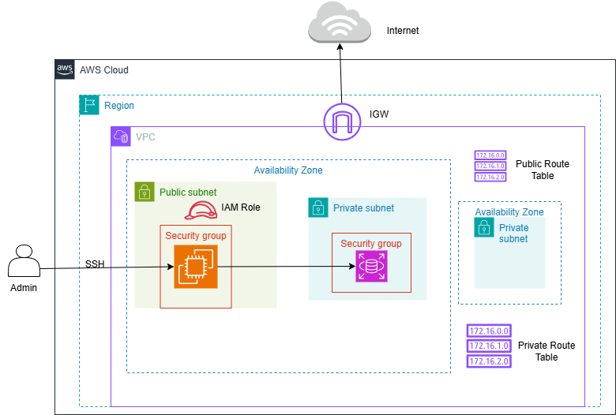

# Deployment Guide — DebtWizard

## 1. Deployment Overview

DebtWizard Backend được triển khai trên AWS với kiến trúc:



Hệ thống chỉ triển khai Backend và Database.

- Backend: Spring Boot Application chạy trên Amazon EC2.
- Database: PostgreSQL chạy trên Amazon RDS.
- EC2 chịu trách nhiệm xử lý REST API và kết nối đến RDS thông qua JDBC.
- Runtime:
  + Java 17
  + Spring Boot 3.x
  + PostgreSQL

---

# 2. AWS Infrastructure Setup

## 2.1 Create VPC

Tạo một Custom VPC để quản lý network của hệ thống.

Example:

```
VPC CIDR:
10.0.0.0/16
```

---

## 2.2 Create Subnets

Hệ thống sử dụng 3 Subnets:

### Public Subnet

Mục đích:

- Chạy EC2 Instance.
- Cho phép SSH truy cập từ Internet.

Architecture:

```text
Public Subnet
      |
      |
     EC2
```

---

### Private Subnets

Mục đích:

- Chứa Amazon RDS PostgreSQL.
- Không expose Database trực tiếp ra Internet.
- Amazon RDS sử dụng DB Subnet Group chứa các subnet thuộc nhiều Availability Zone khác nhau để hỗ trợ khả năng sẵn sàng cao (High Availability) và cho phép triển khai Multi-AZ khi cần thiết.

Trong hệ thống này, RDS PostgreSQL được đặt trong các Private Subnet thuộc hai Availability Zone khác nhau nhằm tăng khả năng mở rộng và đảm bảo database không bị expose trực tiếp ra Internet.

Architecture:

```text
Private Subnet A (AZ-a)

Private Subnet B (AZ-b)

          |
          |
    DB Subnet Group

          |
          |

Amazon RDS PostgreSQL
```

---

## 2.3 Internet Gateway

Tạo và attach Internet Gateway vào VPC.

Route Table cho Public Subnet:

```text
Destination        Target

0.0.0.0/0          Internet Gateway
```

Route này cho phép EC2 truy cập Internet để cài đặt package và pull source code.

---

# 3. Security Group Configuration

## 3.1 EC2 Security Group

Security Group kiểm soát traffic đến Backend Server.

Inbound Rules:

| Type       | Port | Source        |
|------------|------|---------------|
| SSH        | 22   | My IP         |
| HTTP       | 80   | 0.0.0.0/0     |
| Custom TCP | 8080 | 0.0.0.0/0     |

Outbound:

```
Allow all traffic
```

---

## 3.2 RDS Security Group

Security Group bảo vệ Database.

Inbound Rules:

| Type | Port | Source |
|------|------|--------|
| PostgreSQL | 5432 | EC2 Security Group |

Chỉ EC2 Instance được phép kết nối đến RDS.

---

# 4. Launch EC2 Instance

Tạo EC2 Instance:

Configuration:

- OS: Ubuntu
- Instance Type: Free Tier compatible
- Subnet: Public Subnet
- Security Group: EC2 Security Group

Sau khi tạo EC2, sử dụng SSH Key Pair để truy cập server.

---

# 5. Create Amazon RDS PostgreSQL

Tạo PostgreSQL Database trên Amazon RDS.

Configuration:

- Engine: PostgreSQL
- VPC: Custom VPC
- Public Access: No
- DB Subnet Group:
    - Private Subnet A
    - Private Subnet B
- Security Group: RDS Security Group

Sau khi tạo thành công, lấy thông tin:

```
RDS Endpoint
Port: 5432
```

---

# 6. Connect to EC2

SSH vào EC2:

```bash
ssh -i <key.pem> ubuntu@<ec2-public-ip>
```

---

# 7. Install Required Dependencies

Update package:

```bash
sudo apt update
```

## Install Git

```bash
sudo apt install git
```

Verify:

```bash
git --version
```

---

## Install Java

```bash
sudo apt install openjdk-17-jre-headless
```

Verify:

```bash
java -version
```

---

## Install Maven

```bash
sudo apt install maven
```

Verify:

```bash
mvn -version
```

---

## Install PostgreSQL Client

Cài PostgreSQL Client để kết nối đến Amazon RDS:

```bash
sudo apt install postgresql-client
```

Không cần cài PostgreSQL Server trên EC2 vì Database đã được triển khai trên Amazon RDS.

---

# 8. Initialize Database

Kết nối đến RDS:

```bash
psql -h <rds-endpoint> -U postgres -d postgres
```

Tạo database:

```sql
CREATE DATABASE debtwizard;
```

Kiểm tra database:

```sql
\l
```

---

# 9. Clone Backend Source Code

Clone repository:

```bash
git clone <repository-url>
```

Di chuyển vào project:

```bash
cd DebtWizard
```

---

# 10. Configure Environment Variables

Tạo file `.env` trên EC2 để lưu các biến môi trường:

```bash
sudo nano /etc/debtwizard.env
```

Nội dung file:

```properties
DB_HOST=<rds-endpoint>
DB_PORT=5432
DB_NAME=debtwizard
DB_USERNAME=<username>
DB_PASSWORD=<password>
JWT_SECRET=<jwt-secret>
JWT_ACCESS_EXPIRATION=900000
JWT_REFRESH_EXPIRATION=604800000
```

Phân quyền file để bảo vệ thông tin nhạy cảm:

```bash
sudo chmod 600 /etc/debtwizard.env
```

---

# 11. Build Application

Build project bằng Maven:

```bash
mvn clean package -DskipTests
```

Sau khi build thành công:

```
target/DebtWizard-*.jar
```

được tạo ra.

---

# 12. Run Application with systemd

Sử dụng `systemd` để quản lý process — tự động restart khi crash hoặc EC2 reboot.

## 12.1 Create systemd Service

Tạo file service:

```bash
sudo nano /etc/systemd/system/debtwizard.service
```

Nội dung:

```ini
[Unit]
Description=DebtWizard Spring Boot Application
After=network.target

[Service]
User=ubuntu
EnvironmentFile=/etc/debtwizard.env
ExecStart=/usr/bin/java -jar /home/ubuntu/DebtWizard/target/DebtWizard-0.0.1-SNAPSHOT.jar
SuccessExitStatus=143
Restart=on-failure
RestartSec=10


[Install]
WantedBy=multi-user.target
```

## 12.2 Enable và Start Service

```bash
sudo systemctl daemon-reload
sudo systemctl enable debtwizard
sudo systemctl start debtwizard
```

## 12.3 Kiểm tra trạng thái

```bash
sudo systemctl status debtwizard
```

## 12.4 Xem logs

```bash
sudo journalctl -u debtwizard -f
```

Backend chạy tại:

```
http://<ec2-public-ip>:8080
```

---

# 13. Future Improvements

- Containerize application using Docker.
- Push Docker image to Amazon ECR.
- Deploy using Amazon ECS/Fargate.
- CI/CD with GitHub Actions.