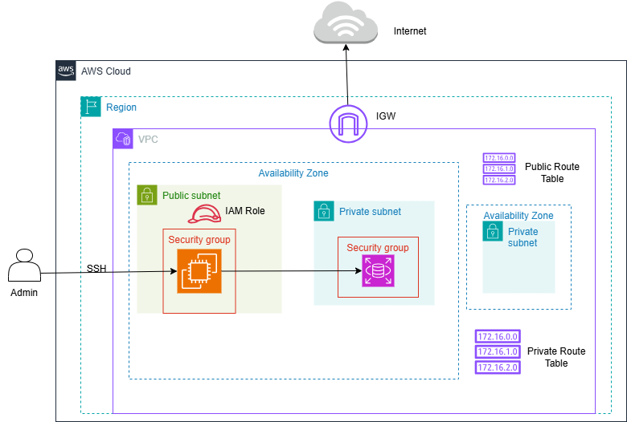

# Deployment Guide — DebtWizard

---

## 1. Tổng quan Kiến trúc Triển khai (Deployment Overview)

DebtWizard Backend được triển khai trên nền tảng đám mây **Amazon Web Services (AWS)** với mô hình phân tách giữa tầng ứng dụng và tầng cơ sở dữ liệu:



- **Backend Server:** Ứng dụng Spring Boot chạy trên máy chủ ảo **Amazon EC2 (Ubuntu 22.04 LTS)** đặt trong Public Subnet.
- **Database Server:** Cơ sở dữ liệu **PostgreSQL** chạy trên dịch vụ quản lý **Amazon RDS**, đặt trong Private Subnets đa vùng sẵn sàng (Multi-AZ DB Subnet Group), không thể truy cập trực tiếp từ Internet.
- **Giao tiếp:** EC2 kết nối an toàn đến Amazon RDS thông qua giao thức JDBC (Port 5432) trong nội bộ mạng AWS VPC.
- **Môi trường Runtime:** Java 17 (OpenJDK), Spring Boot 3.2.4, Maven 3.8+, PostgreSQL 14+.

---

## 2. Thiết lập Hạ tầng AWS (AWS Infrastructure Setup)

### 2.1 Tạo Custom VPC
Tạo một Virtual Private Cloud (VPC) để cô lập mạng lưới:
- **IPv4 CIDR Block:** `10.0.0.0/16`
- **Tên VPC:** `debtwizard-vpc`

### 2.2 Tạo Subnets & Route Tables
Hệ thống sử dụng tối thiểu 3 Subnets thuộc ít nhất 2 Availability Zones (AZs):

1. **Public Subnet (AZ-a):**
   - **CIDR:** `10.0.1.0/24`
   - **Mục đích:** Chứa EC2 Instance, gán Public IPv4.
   - **Route Table:** Gắn `0.0.0.0/0` trỏ đến **Internet Gateway (IGW)**.
2. **Private Subnet 1 (AZ-a):**
   - **CIDR:** `10.0.2.0/24`
   - **Mục đích:** Chứa nút chính của Amazon RDS PostgreSQL.
3. **Private Subnet 2 (AZ-b):**
   - **CIDR:** `10.0.3.0/24`
   - **Mục đích:** Dự phòng cho Amazon RDS (DB Subnet Group).
   - **Route Table:** Nội bộ VPC (`10.0.0.0/16` -> `local`), tuyệt đối không mở route ra Internet Gateway.

---

## 3. Cấu hình Nhóm Bảo mật (Security Groups)

### 3.1 EC2 Security Group (`debtwizard-ec2-sg`)
Kiểm soát traffic đi vào máy chủ ứng dụng:

| Loại traffic | Giao thức | Port | Nguồn (Source) | Mục đích |
|---|---|---|---|---|
| SSH | TCP | 22 | `My IP` (hoặc Bastion IP) | Quản trị từ xa an toàn |
| HTTP | TCP | 80 | `0.0.0.0/0` | Web Traffic (hoặc Nginx Reverse Proxy) |
| Custom TCP | TCP | 8080 | `0.0.0.0/0` | Spring Boot REST API & Swagger UI |
| Outbound | Tất cả | Tất cả | `0.0.0.0/0` | Cho phép EC2 tải package và pull git |

### 3.2 RDS Security Group (`debtwizard-rds-sg`)
Bảo vệ cơ sở dữ liệu chỉ chấp nhận kết nối từ Backend:

| Loại traffic | Giao thức | Port | Nguồn (Source) | Mục đích |
|---|---|---|---|---|
| PostgreSQL | TCP | 5432 | `debtwizard-ec2-sg` (Security Group ID của EC2) | Chỉ EC2 được phép truy vấn Database |
| Outbound | Tất cả | Tất cả | `0.0.0.0/0` | Mặc định |

---

## 4. Khởi tạo Amazon RDS PostgreSQL

1. Điều hướng tới **Amazon RDS** -> **Create Database**.
2. **Engine:** PostgreSQL (Phiên bản 14 trở lên).
3. **Template:** Free Tier (hoặc Production Multi-AZ tùy nhu cầu).
4. **VPC:** Chọn `debtwizard-vpc`.
5. **DB Subnet Group:** Tạo nhóm chứa `Private Subnet 1` và `Private Subnet 2`.
6. **Public Access:** Chọn **No** (Không mở ra Internet).
7. **VPC Security Group:** Chọn `debtwizard-rds-sg`.
8. Sau khi tạo xong, lưu lại **RDS Endpoint** (ví dụ: `debtwizard-db.xxxx.ap-southeast-1.rds.amazonaws.com`).

---

## 5. Cài đặt & Cấu hình Máy chủ EC2

### 5.1 Kết nối SSH vào EC2
```bash
ssh -i /path/to/your-key.pem ubuntu@<EC2-PUBLIC-IP>
```

### 5.2 Cài đặt các gói phụ thuộc
```bash
# Cập nhật hệ thống
sudo apt update && sudo apt upgrade -y

# Cài đặt Git, Java 17, Maven và PostgreSQL Client
sudo apt install -y git openjdk-17-jre-headless maven postgresql-client

# Kiểm tra phiên bản
java -version
mvn -version
psql --version
```

### 5.3 Khởi tạo Cơ sở dữ liệu trên RDS
Sử dụng `psql` từ EC2 để kết nối đến RDS Endpoint và tạo cơ sở dữ liệu:
```bash
psql -h <RDS-ENDPOINT> -U postgres -d postgres
```
Nhập mật khẩu RDS khi được yêu cầu, sau đó thực thi:
```sql
CREATE DATABASE debtwizard;
\l
\q
```

---

## 6. Triển khai Ứng dụng Backend

### 6.1 Clone mã nguồn dự án
```bash
cd /home/ubuntu
git clone https://github.com/Qt159/DebtWizard.git
cd DebtWizard
```

### 6.2 Cấu hình Biến môi trường
Tạo file cấu hình môi trường an toàn tại `/etc/debtwizard.env`:
```bash
sudo nano /etc/debtwizard.env
```

Nhập các thông số thực tế của môi trường:
```properties
# Database Configuration
DB_HOST=<RDS-ENDPOINT>
DB_PORT=5432
DB_NAME=debtwizard
DB_USERNAME=postgres
DB_PASSWORD=YourSecureDatabasePassword

# JWT Configuration
JWT_SECRET=your_super_secret_jwt_key_at_least_32_characters_long_123456
JWT_ACCESS_EXPIRATION=900000
JWT_REFRESH_EXPIRATION=604800000
```

Phân quyền bảo mật file (chỉ root và service đọc được):
```bash
sudo chmod 600 /etc/debtwizard.env
```

### 6.3 Đóng gói Ứng dụng (Build Jar)
```bash
mvn clean package -DskipTests
```
File thực thi `.jar` sẽ được tạo tại: `/home/ubuntu/DebtWizard/target/DebtWizard-0.0.1-SNAPSHOT.jar`.

---

## 7. Quản trị Dịch vụ bằng Linux Systemd

Sử dụng `systemd` để ứng dụng chạy nền liên tục và tự khởi động lại khi gặp sự cố hoặc máy chủ reboot.

### 7.1 Tạo Service File
```bash
sudo nano /etc/systemd/system/debtwizard.service
```

Nội dung cấu hình:
```ini
[Unit]
Description=DebtWizard Spring Boot Application
After=network.target

[Service]
User=ubuntu
WorkingDirectory=/home/ubuntu/DebtWizard
EnvironmentFile=/etc/debtwizard.env
ExecStart=/usr/bin/java -jar /home/ubuntu/DebtWizard/target/DebtWizard-0.0.1-SNAPSHOT.jar
SuccessExitStatus=143
Restart=on-failure
RestartSec=10

[Install]
WantedBy=multi-user.target
```

### 7.2 Khởi động và Kích hoạt Dịch vụ
```bash
# Nạp lại cấu hình daemon
sudo systemctl daemon-reload

# Kích hoạt tự khởi động cùng OS
sudo systemctl enable debtwizard

# Khởi chạy dịch vụ
sudo systemctl start debtwizard

# Kiểm tra trạng thái hoạt động
sudo systemctl status debtwizard
```

### 7.3 Theo dõi Logs thời gian thực
```bash
sudo journalctl -u debtwizard -f
```

Kiểm tra API trên trình duyệt hoặc Postman:
- API Base URL: `http://<EC2-PUBLIC-IP>:8080`
- Swagger UI: `http://<EC2-PUBLIC-IP>:8080/swagger-ui/index.html`

---

## 8. Quy trình Cập nhật Phiên bản (CI / CD & Update Workflow)

Mỗi khi có cập nhật mã nguồn mới trên GitHub:
```bash
cd /home/ubuntu/DebtWizard
git pull origin main
mvn clean package -DskipTests
sudo systemctl restart debtwizard
sudo journalctl -u debtwizard -n 50 --no-pager
```

---

## 9. Định hướng Mở rộng trong Tương lai (Future Improvements)

1. **Reverse Proxy & SSL:** Cấu hình **Nginx** làm Reverse Proxy kết hợp **Let's Encrypt** để kích hoạt HTTPS (Port 443).
2. **Containerization:** Đóng gói ứng dụng thành **Docker Image**, đẩy lên **Amazon ECR**.
3. **Container Orchestration:** Triển khai bằng **Amazon ECS (AWS Fargate)** kết hợp **Application Load Balancer (ALB)** để tự động mở rộng (Auto Scaling).
4. **CI/CD Automation:** Xây dựng **GitHub Actions Workflow** để tự động chạy Unit Test, đóng gói Jar/Docker và deploy lên AWS khi push code vào nhánh `main`.