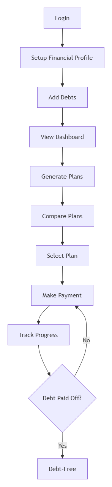
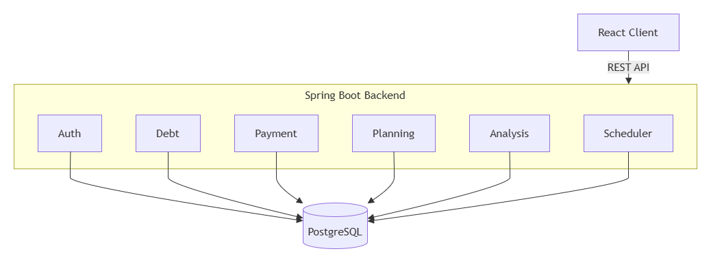

# Software Architecture Document (SAD) — DebtWizard

## 1. Giới thiệu

### 1.1 Mục tiêu hệ thống

**Problem**
Nhiều người đang mắc nhiều khoản nợ cùng lúc nhưng không biết:
- Nên ưu tiên trả khoản nào trước
- Nếu có thêm tiền dư thì nên phân bổ như thế nào
- Kế hoạch nào giúp tiết kiệm lãi nhiều nhất hoặc giảm áp lực dòng tiền
- Khi nào có thể thoát nợ
- Sức khỏe tài chính hiện tại đang ở mức nào

**System Goal**
- Quản lý các khoản nợ cá nhân và lịch sử thanh toán
- Tính lãi tự động và theo dõi dư nợ còn lại
- Phân tích sức khỏe tài chính qua 4 chỉ số định lượng
- Mô phỏng và so sánh 2 chiến lược trả nợ
- Hỗ trợ người dùng đưa ra quyết định trả nợ phù hợp với mục tiêu tài chính

### 1.2 Phạm vi hệ thống
- Quản lý khoản nợ cá nhân: BANKING, PERSONAL_LOAN, CREDIT
- Hỗ trợ 2 phương pháp tính lãi: FLAT và REDUCING_BALANCE
- Tính lãi tự động hàng ngày qua Scheduler
- Xử lý thanh toán theo nguyên tắc interest-first allocation
- Phân tích 4 chỉ số: DTI, Interest Ratio, Overdue Ratio, Repayment Time
- Mô phỏng 2 chiến lược trả nợ: Minimize Interest (Avalanche) và Improve Cashflow
- Lưu trữ thông tin thu nhập/chi tiêu hàng tháng để phục vụ phân tích

### 1.3 Quy trình tổng quát



---

## 2. Kiến trúc hệ thống

```
Client (React)
      ↓ HTTP/REST + JWT Bearer Token
Spring Security Filter Chain (JwtAuthenticationFilter)
      ↓
Controller Layer
      ↓
Service Layer
      ↓
Repository Layer (Spring Data JPA)
      ↓
PostgreSQL
```

Hệ thống sử dụng **Feature-Based Architecture** kết hợp **Layered Architecture** bên trong từng module. Mỗi feature được tổ chức độc lập, bao gồm đầy đủ Controller, Service, Repository, DTO và Mapper.



---

## 3. Kiến trúc module

| Module | Chức năng chính |
|--------|-----------------|
| **auth** | Đăng ký, đăng nhập, refresh JWT |
| **user** | Quản lý hồ sơ người dùng, đổi mật khẩu |
| **debt** | CRUD khoản nợ, tính lãi, quản lý trạng thái, soft-delete |
| **payment** | Xử lý thanh toán, soft-delete, soft-update |
| **planning** | Mô phỏng và so sánh kế hoạch trả nợ |
| **analysis** | Phân tích 4 chỉ số sức khỏe tài chính |
| **dashboard** | Tổng hợp thông tin tài chính tổng quan |
| **scheduler** | Tác vụ định kỳ hàng ngày: cộng lãi, refresh trạng thái |

---

## 4. Thiết kế tầng hệ thống

### 4.1 Controller Layer
- Nhận request HTTP, xác thực user hiện tại qua `@AuthenticationPrincipal`
- Validate dữ liệu đầu vào qua Bean Validation (`@Valid`)
- Gọi Service Layer và trả về `ApiResponse<T>`

### 4.2 Service Layer & Business Rules

**DebtService**
- Tạo khoản nợ, tính `expectedMonthlyPayment` theo đúng công thức (FLAT hoặc REDUCING_BALANCE) qua `InterestCalculationService`
- Soft-delete khoản nợ (`deleted = true`)
- Hiện tại chỉ cho phép update `lenderName`

**InterestCalculationService + Strategy Pattern**
- Interface `InterestCalculationStrategy` với 2 method:
  - `calculateInterest(debt, fromDate, toDate)` — dùng cho accrual hàng ngày
  - `calculateMonthlyPayment(principal, termMonths, annualRate)` — dùng khi tạo debt
- `FlatInterestCalculationStrategy`: tính lãi trên `totalPrincipal`
- `ReducingBalanceInterestCalculationStrategy`: tính lãi trên `remainingPrincipal`, công thức amortization chuẩn

**InterestAccrualService**
- Cộng dồn lãi từ `lastInterestAccruedDate` đến ngày chỉ định
- Cập nhật `accruedInterest` và `lastInterestAccruedDate` trên Debt

**DebtStateService**
- `refreshDebtStatus`: PAID_OFF nếu `totalOutstanding ≤ 0`; OVERDUE nếu quá `nextDueDate`; else ACTIVE
- `moveNextDueDate`: chuyển `nextDueDate` sang tháng tiếp theo nếu payment >= `expectedMonthlyPayment`
- `calculateFirstDueDate`: tính ngày đến hạn đầu tiên từ `startDate` và `dueDay`

**PaymentService**
- Validate: debt tồn tại, chưa PAID_OFF, ngày thanh toán hợp lệ
- Accrual lãi đến ngày thanh toán trước khi phân bổ
- Interest-first allocation: trừ `accruedInterest` trước, phần còn lại vào `remainingPrincipal`
- Soft-delete (`deleted = true`) và soft-update (chỉ `note` và `paymentDate`)

**PlanningService + SimulationEngine**
- Verify ownership từng debt trước khi simulate
- Convert Debt → DebtSnapshot (balance = remainingPrincipal + accruedInterest)
- Chạy simulation độc lập cho 2 strategy
- Trả về schedule chi tiết từng tháng với per-debt breakdown

**AnalysisService**
- DTI: `totalActiveExpectedMonthlyPayment / monthlyIncome × 100`
- Interest Ratio: `totalAccruedInterest / monthlyIncome × 100`
- Overdue Ratio: `overdueDebtCount / (activeDebtCount + overdueDebtCount) × 100`
- Repayment Time: `totalRemainingDebt / totalActiveExpectedMonthlyPayment` (tháng)

**DebtScheduler**
- Chạy daily tại 00:00 server time
- Xử lý batch 100 debts/page, chỉ lấy non-PAID_OFF
- Per-debt: accrueInterest → refreshDebtStatus

### 4.3 Repository Layer
- CRUD qua Spring Data JPA
- Custom queries: tổng hợp (SUM), đếm theo status, filter theo userId + status + deleted

---

## 5. Cơ sở dữ liệu

### Bảng chính

| Bảng | Mô tả |
|------|-------|
| `users` | Thông tin người dùng, monthly income/expense |
| `debts` | Khoản nợ, embedded InterestSettings, soft-delete |
| `payments` | Lịch sử thanh toán, soft-delete |
| `refresh_tokens` | JWT refresh token rotation |

> Bảng `repayment_plans` không tồn tại — planning là stateless, simulate theo request.

### Quan hệ
- User (1) → (N) Debt
- Debt (1) → (N) Payment
- User (1) → (1) RefreshToken

### InterestSettings (Embedded trong Debt)
- `interestCalculationMethod`: FLAT | REDUCING_BALANCE
- `interestFrequency`: DAILY | MONTHLY | ANNUALLY
- `interestRate`: BigDecimal (% năm, ví dụ 12.0 = 12%/năm)


---

## 6. Bảo mật

- **JWT stateless authentication**: access token (15 phút) + refresh token (7 ngày)
- **Token rotation**: mỗi lần refresh, token cũ bị xóa, token mới được lưu DB
- **BCrypt** mã hóa mật khẩu
- **Bean Validation** validate toàn bộ request input
- **Ownership check** trong mọi service: verify userId trước khi xử lý
- Chưa triển khai RBAC — toàn bộ authenticated users có quyền ngang nhau trên data của mình
- CORS: chỉ cho phép `http://localhost:3000`

---

## 7. Data Flow (Luồng xử lý)

### 7.1 Tạo khoản nợ

```
User → POST /api/debts
  → DebtController → DebtService
  → Map DTO → Debt entity
  → Tính expectedMonthlyPayment qua InterestCalculationStrategy
     - FLAT: M = P/n + P × (rate/100/12)
     - REDUCING_BALANCE: M = P × [r(1+r)^n] / [(1+r)^n - 1]
  → Tính firstDueDate từ startDate + dueDay
  → Save Debt
  → DebtResponseDTO
```

### 7.2 Tạo thanh toán

```
User → POST /api/payments
  → PaymentService.createPayment()
  → Validate: debt tồn tại, chưa PAID_OFF, ngày hợp lệ
  → InterestAccrualService: cộng lãi từ lastInterestAccruedDate đến paymentDate
  → Interest-first allocation:
       interestPaid = min(amount, accruedInterest)
       principalPaid = min(amount - interestPaid, remainingPrincipal)
  → Cập nhật debt: accruedInterest, remainingPrincipal, lastPaymentDate
  → DebtStateService.moveNextDueDate()
  → DebtStateService.refreshDebtStatus() → PAID_OFF / OVERDUE / ACTIVE
  → Save Debt + Save Payment
  → PaymentResponseDTO
```

### 7.3 Cập nhật tự động hàng ngày

```
00:00 Daily → DebtScheduler
  → findByDeletedFalseAndStatusNot(PAID_OFF) — batch 100
  → Per debt:
      InterestAccrualService.accrueInterest(debt, today)
      DebtStateService.refreshDebtStatus(debt)
  → Save batch
```

### 7.4 So sánh kế hoạch trả nợ

```
User → POST /api/planning/compare
  { debtIds, monthlyExtraPayment, firstStrategy, secondStrategy }
  → Verify ownership từng debtId
  → SnapshotMapper: Debt → DebtSnapshot
       balance = remainingPrincipal + accruedInterest
       interestRate = interestSettings.interestRate
       minimumPayment = expectedMonthlyPayment
  → SimulationEngine.simulate() × 2 (độc lập)
      Mỗi tháng:
        applyMonthlyInterest: balance × (rate/100/12)
        applyMinimumPayments: trừ minimumPayment từng debt
        strategy.selectTargetDebt(): chọn debt ưu tiên
        applyExtraPayment: trừ extra vào target
        releaseCashflow: debt paid off → minimumPayment chuyển vào extra pool
        ghi SimulationMonth với per-debt breakdown
  → RepaymentMapper: SimulationResult → PlanComparisonDto
       bao gồm schedule[] từng tháng
  → CompareResponse { firstPlan, secondPlan }
```

**Chiến lược chọn debt:**
- `MINIMIZE_INTEREST` (Avalanche): chọn debt có `interestRate` cao nhất
- `IMPROVE_CASHFLOW`: chọn debt có `score = minimumPayment / estimatedPayoffMonths` cao nhất

### 7.5 Phân tích sức khỏe tài chính

```
User → GET /api/analysis/all
  → AnalysisService.calculateAllAnalysis()
  → 4 chỉ số song song:
      DTI = totalActiveExpectedMonthlyPayment / monthlyIncome × 100
            GOOD: <30%, WARNING: 30-50%, CRITICAL: >50%
      Interest Ratio = totalAccruedInterest / monthlyIncome × 100
            GOOD: <10%, WARNING: 10-20%, CRITICAL: >20%
      Overdue Ratio = overdueCount / (activeCount + overdueCount) × 100
            GOOD: <30%, WARNING: 30-50%, CRITICAL: >50%
      Repayment Time = totalRemainingDebt / totalActiveExpectedMonthlyPayment (tháng)
  → AnalysisResponse { dti, interestRatio, overdue, repaymentTime, analysisDate }
```

---

## 8. API Endpoints

| Method | Endpoint | Mô tả |
|--------|----------|-------|
| POST | /api/auth/register | Đăng ký |
| POST | /api/auth/login | Đăng nhập |
| POST | /api/auth/refresh | Refresh token |
| GET | /api/users/me | Lấy profile |
| PUT | /api/users/me | Cập nhật profile |
| POST | /api/users/change-password | Đổi mật khẩu |
| GET | /api/dashboard | Dashboard tổng quan |
| POST | /api/debts | Tạo khoản nợ |
| GET | /api/debts | Danh sách khoản nợ (filter by status) |
| GET | /api/debts/{id} | Chi tiết khoản nợ |
| PUT | /api/debts/{id} | Cập nhật khoản nợ |
| DELETE | /api/debts/{id} | Xóa khoản nợ (soft-delete) |
| GET | /api/debts/{id}/payments | Lịch sử thanh toán theo khoản nợ |
| POST | /api/payments | Ghi thanh toán |
| GET | /api/payments | Toàn bộ lịch sử thanh toán |
| GET | /api/payments/{id} | Chi tiết thanh toán |
| PUT | /api/payments/{id} | Cập nhật note/date (soft-update) |
| DELETE | /api/payments/{id} | Xóa thanh toán (soft-delete) |
| GET | /api/analysis/all | Phân tích 4 chỉ số |
| POST | /api/planning/compare | So sánh 2 kế hoạch |

---

## 9. Design Patterns sử dụng

| Pattern | Áp dụng tại |
|---------|-------------|
| Feature-Based + Layered Architecture | Toàn bộ project |
| Strategy Pattern | `InterestCalculationStrategy` (FLAT/REDUCING_BALANCE), `DebtSelectionStrategy` (Avalanche/Cashflow) |
| Factory Pattern | `InterestCalculationStrategyFactory` |
| DTO Pattern | Tất cả Controller ↔ Service boundary |
| Mapper Pattern | `DebtMapper`, `PaymentMapper`, `SnapshotMapper`, `RepaymentMapper` |
| Scheduler Pattern | `DebtScheduler` — daily cron job |
| Simulation Engine Pattern | `SimulationEngine` — stateless monthly simulation loop |
| Soft Delete Pattern | `Debt.deleted`, `Payment.deleted` |
