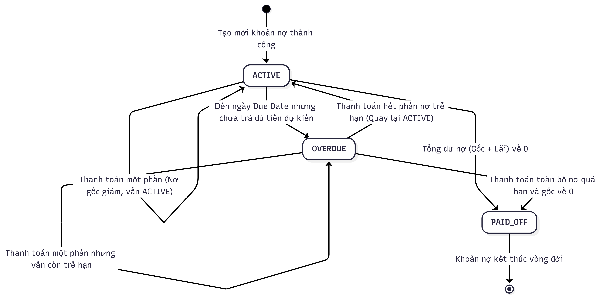
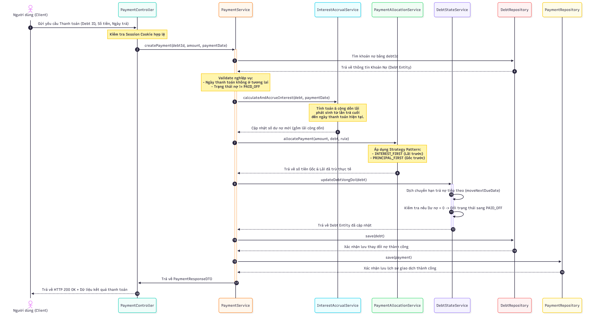
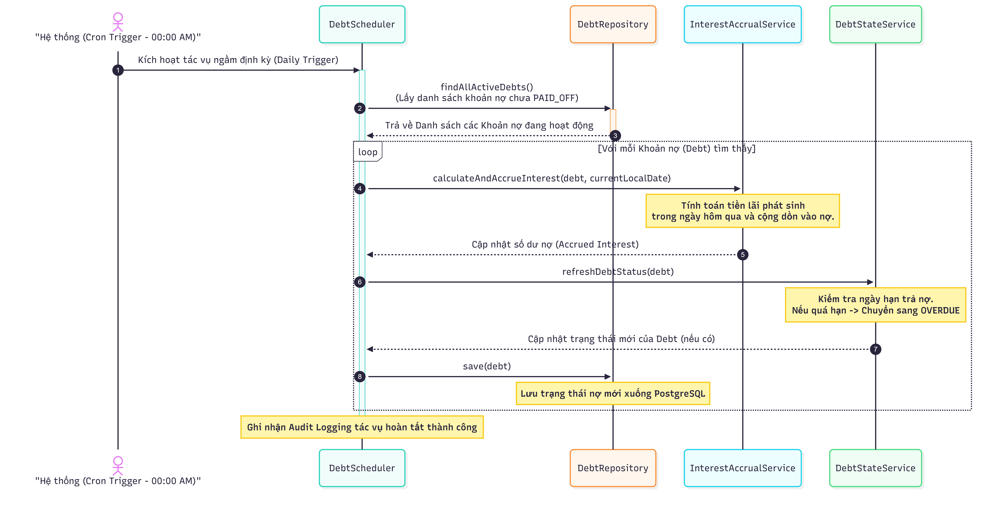

# **Software Architecture Document (SAD) - DebtWizard**

## 1. Giới thiệu

### 1.1 Mục tiêu hệ thống

Quản lý nợ cá nhân, hỗ trợ thanh toán, tính lãi, phân tích sức khỏe tài chính và đề xuất chiến lược trả nợ.

### 1.2 Phạm vi hệ thống

Hệ thống hỗ trợ:

  * Quản lý khoản nợ.
    * Quản lý thanh toán.
    * Tính lãi tự động.
    * Phân tích tình hình tài chính.
    * Gợi ý chiến lược trả nợ (Snowball / Avalanche).
    * Phân tích dữ liệu bằng R theo hai hướng:
        + Ước lượng thời gian tất toán nợ, theo dõi tiến độ trả nợ.
        + Xây dựng hồ sơ sức khỏe tài chính (Financial Health Profile) thông qua các kỹ thuật thống kê đa biến như PCA, Factor Analysis, và Clustering nhằm hỗ trợ phân tích dữ liệu tài chính cá nhân.

### 1.3 Hướng phát triển (Planned Features)

  - Mô phỏng tài chính (Simulation) giúp người dùng thử nghiệm các kịch bản trả nợ khác nhau.
    - Tích hợp hệ thống AI Recommendation để đề xuất chiến lược trả nợ tối ưu (Snowball, Avalanche hoặc hybrid strategy).
    - Hệ thống thông báo (Notification System) nhắc lịch thanh toán.
    - Cơ chế Gamification nhằm tăng động lực trả nợ (streak, achievement, progress reward)

---

## 2. Kiến trúc hệ thống

Hệ thống sử dụng kiến trúc **Feature-Based Architecture kết hợp Layered Architecture bên trong từng module**.
Mỗi feature được tổ chức độc lập, bao gồm đầy đủ các tầng Controller, Service và Repository.
  - Controller: Xử lý request
    - Service: Xử lý logic nghiệp vụ
    - Repository: Truy cập dữ liệu


---

## 3. Kiến trúc module
| Module | Chức năng chính                                                                  | Công nghệ |
| --- |----------------------------------------------------------------------------------| --- |
| **Auth** | Đăng ký, đăng nhập, session, OAuth2                                              | Spring Security, HttpSession |
| **Debt** | CRUD khoản nợ, trạng thái nợ                                                     | JPA/Hibernate |
| **Payment** | Phân bổ dòng tiền, cập nhật trạng thái nợ                                        | Service Layer + Rules |
| **Interest** | Tính lãi suất, cộng dồn lãi                                                      | Strategy Pattern |
| **Summary** | Tổng hợp dữ liệu tài chính                                                       | Aggregate Queries |
| **Analysis** | DTI, Interest Ratio, Overdue, Repayment Forecast, Financial Health Profiling (R) | Service + R |
| **Recommendation** | Snowball/Avalanche strategy                                                      | Strategy Pattern |
| **Scheduler** | Tác vụ định kỳ (cộng lãi, refresh trạng thái)                                    | Spring Scheduler |
---

## 4. Thiết kế tầng hệ thống

### 4.1 Controller Layer

  * Nhận request từ client, xác thực User hiện tại
    * Validate dữ liệu đầu vào
    * Controller layer trả về các DTO response tương ứng cho client sau khi nhận kết quả xử lý từ Service layer.

### 4.2 Service Layer & Business Rules

  * Chứa toàn bộ business logic của hệ thống, bao gồm xử lý vòng đời khoản nợ, phân bổ thanh toán, tính toán lãi suất và các quy tắc đánh giá sức khỏe tài chính. Một số quy tắc nghiệp vụ (Business Rules) quan trọng được implement tại đây:
    - Quy tắc phân bổ thanh toán (Payment Application Rule):
      + Interest First: Tiền thanh toán sẽ trừ vào phần Lãi (Accrued Interest) trước, dư mới trừ vào Gốc (Remaining Principal).
      + Principal First: Ưu tiên trừ vào Gốc trước, dư mới trừ vào Lãi.
    - Ràng buộc thời gian thanh toán: Hệ thống nghiêm cấm thanh toán ảo (ngày ở tương lai), cấm thanh toán trước khi khoản nợ bắt đầu, và cấm thanh toán lùi thời gian so với lần trả gần nhất.
    - Đánh giá sức khỏe tài chính (Financial Health Assessment): 
      + DTI
      + Interest Ratio
      + Overdue Ratio
      + Repayment Time
            

### 4.3 Repository Layer

  * Giao tiếp với database
    * CRUD thông qua JPA/Hibernate

---

## 5. Cơ sở dữ liệu


Hệ thống gồm các bảng chính:

  * users
  * debts
  * payments
  * interest_configs

### Quan hệ:
  * User (1) → (N) Debt
  * Debt (1) → (N) Payment
  * Debt (1) → (1) InterestConfig


---

## 6. Bảo mật hệ thống

* Cookie-based Session: Sau khi xác thực thành công, thông tin của người dùng được lưu trữ phía Server (hạn chế tối đa việc lộ thông tin nhạy cảm). Client nhận diện phiên qua mã định danh `JSESSIONID` lưu trong Cookie.
  * Validate toàn bộ request bằng Bean Validation.
  * Mã hóa mật khẩu bằng BCrypt trước khi lưu vào cơ sở dữ liệu.
  * Mọi truy vấn liên quan đến Debt và Payment đều được kiểm tra userId khớp với User đang đăng nhập nhằm đảm bảo phân quyền dữ liệu.
  * Hệ thống hiện tại chỉ hỗ trợ một loại người dùng (User), chưa triển khai role-based access control (RBAC).
  * Hỗ trợ xác thực qua Google OAuth2.
  * Audit Logging: Ghi nhận các hành vi quan trọng của người dùng và hệ thống (đăng nhập, tạo/sửa/xóa khoản nợ, thực hiện thanh toán, thay đổi cấu hình lãi suất, và các tác vụ nền như scheduled interest accrual). Log được lưu dưới dạng có cấu trúc để phục vụ truy vết, giám sát và tăng cường bảo mật.
---

## 7. Data Flow (Luồng xử lý)

### 7.1 Tạo khoản nợ
```text id ="flow1"
User → Controller → DebtService 
  ├─> Map DTO to Entity (DebtMapper)
  ├─> DebtStateService: Tính toán ngày hạn trả đầu tiên (calculateFirstDueDate)
  ├─> DebtService: Tính toán số tiền trả dự kiến hàng tháng (Expected Monthly Payment)
  ├─> Khởi tạo InterestConfig (InterestConfigMapper)
  └─> Lữu dữ liệu (DebtRepository) → Trả về DebtResponseDTO được map từ Debt entity.
```
### 7.2 Tạo thanh toán

```text id="flow2"
User → Controller → PaymentService (createPayment)
  ├─> Lấy dữ liệu Debt & Validate nghiệp vụ (Ngày thanh toán hợp lệ, chưa PAID_OFF)
                          └─> Nếu validate FAIL → Trả về ErrorResponseDTO (mã lỗi + thông điệp)
  ├─> InterestAccrualService: Tính toán và cộng dồn lãi suất đến ngày thanh toán
  ├─> PaymentAllocationService (Phân bổ dòng tiền):
  │    └─> Dựa vào Rule (INTEREST_FIRST/PRINCIPAL_FIRST) để trừ tiền Lãi và Gốc
  ├─> Cập nhật thông tin Debt:
  │    ├─> Cập nhật LastPaymentDate
  │    ├─> DebtStateService: Dịch chuyển hạn trả nợ tiếp theo (moveNextDueDate)
  │    └─> DebtStateService: Cập nhật trạng thái (refreshDebtStatus) -> PAID_OFF nếu nợ = 0
  └─> Save Debt & Save Payment → Trả về PaymentResponseDTO sau khi xử lý phân bổ thanh toán và cập nhật khoản nợ.
```


---

### 7.3 Tính tổng nợ (Summary)

```text id="flow3"
Request → Controller → SummaryService
  ├─> Truy xuất Aggregate Queries từ Repository (Total Debt, Remaining, Overdue, Accrued Interest...)
  ├─> Phân tích Logic (Next Due Debt Info):
  │    └─> Duyệt các khoản nợ ACTIVE, dùng ChronoUnit tính khoảng cách ngày đến hạn gần nhất
  └─> Trả về SummaryResponseDTO chứa tổng hợp dữ liệu tài chính.
```
### 7.4 Luồng cập nhật tự động hàng ngày
```text id ="flow4"
System Trigger (00:00 Daily) → DebtScheduler
  ├─> Lấy danh sách toàn bộ khoản nợ đang hoạt động (Status != PAID_OFF)
  ├─> InterestAccrualService: Tính toán và cộng dồn lãi suất tự động
  └─> DebtStateService: Kiểm tra và chuyển trạng thái (VD: từ ACTIVE sang OVERDUE)
```


### 7.5 Đề xuất chiến lược trả nợ (Debt Recommendation)
```text id ="flow5"
User → Controller → DebtRecommendationService
├─> Lấy danh sách Active Debts
├─> Apply Recommendation Strategy
│      └─> RecommendationStrategyFactory
│             ├─> SnowballStrategy: Sắp xếp ưu tiên theo dư nợ gốc tăng dần
│             └─> AvalancheStrategy: Sắp xếp ưu tiên theo lãi suất giảm dần
│
└─> DebtRecommendationMapper → Trả về DebtRecommendationResponseDTO dựa trên chiến lược đã chọn
```
### 7.6 Phân tích tình hình tài chính (Analysis)

* Công thức áp dụng:
    - **DTI (Debt-to-Income Ratio)** = (Total Active Expected Monthly Payment / Monthly Income) × 100
    - **Interest Ratio** = Monthly Income / Total Accrued Interest
    - **Overdue Ratio** = Overdue Debts / Total Active Debts
    - **Repayment Time** = Total Remaining Debt / Total Active Expected Monthly Payment (làm tròn lên số tháng)
```text id ="flow6"
User → Controller → AnalysisService (calculateAllAnalysis)
    ├── Financial Analysis
    │      ├── DtiResponse: Tỷ lệ nợ trên thu nhập (Debt-to-Income Ratio)
    │      ├── InterestRatioResponse: Đánh giá khả năng chi trả lãi từ thu nhập hiện tại
    │      ├── OverdueRatioResponse: Tỷ lệ khoản nợ quá hạn trên tổng số khoản nợ đang hoạt động
    │      └── RepaymentTimeResponse: Ước lượng thời gian tất toán toàn bộ khoản nợ
    │
    └── Financial Health Profiling (R Integration)
           ├── PCA (Principal Component Analysis)
           │      → Giảm số chiều dữ liệu tài chính và trích xuất Principal Components (PC1, PC2, PC3)
           │
           ├── Factor Analysis
           │      → Khám phá các nhân tố tiềm ẩn như Financial Stability, Debt Pressure và Repayment Capacity
           │
           └── Clustering Analysis
                  → Phân nhóm các giai đoạn tài chính theo thời gian dựa trên DTI, Interest Ratio,
                    Overdue Ratio và Repayment Time
                  → Stable Period / Debt Growth Period / Recovery Period / High Debt Pressure Period

↓

Financial Health Profile

↓

AnalysisResponseDTO
```

---

### 7.7 Đánh giá sức khỏe tài chính (Finance Classification)

* Hệ thống sử dụng `FinanceClassifier` để phân loại tình trạng tài chính dựa trên tỷ lệ (ratio) tính toán được:
  - Nếu chỉ số càng **thấp càng tốt** (ví dụ: DTI, Overdue Ratio):
      * GOOD: ratio ≤ ngưỡng GOOD
      * WARNING: ratio ≤ ngưỡng WARNING
      * CRITICAL: ratio > ngưỡng WARNING
  - Nếu chỉ số càng **cao càng tốt** (ví dụ: Interest Ratio, khả năng chi trả lãi):
      * GOOD: ratio ≥ ngưỡng GOOD
      * WARNING: ratio ≥ ngưỡng WARNING
      * CRITICAL: ratio < ngưỡng WARNING
        Kết quả phân loại được ánh xạ sang enum `FinanceHealth` với 3 mức:
  - **GOOD**: Tài chính lành mạnh
  - **WARNING**: Cần chú ý, có nguy cơ
  - **CRITICAL**: Tài chính nguy cấp, cần hành động ngay

Mỗi trạng thái đi kèm với lời khuyên mặc định (`defaultAdvice`) để hỗ trợ người dùng ra quyết định.

---

## 8. Design Patterns sử dụng
  * **Controller-Service-Repository Pattern** (Layered Architecture per feature)
    * **Service Layer Pattern** (tách business logic khỏi controller)
    * **ORM Pattern** (JPA/Hibernate Entity Mapping)
    * **Strategy Pattern** Áp dụng trong tính lãi (InterestCalculationMethod) và phân bổ trả nợ (Snowball / Avalanche).
    * **Mapper / DTO Pattern**: Sử dụng các class Mapper để chuyển đổi dữ liệu an toàn giữa Client và Database.
    * **Scheduled Task / Background Worker Pattern**: Ứng dụng trong DebtScheduler để xử lý tác vụ ngầm định kỳ.


---


## 9. Hệ thống phân tích (R Integration)

Hệ thống tích hợp R để thực hiện các phân tích thống kê đa biến nhằm khai thác dữ liệu tài chính và hỗ trợ xây dựng Financial Health Profile.

### Quy trình xử lý

```text
PostgreSQL Database
        ↓
Data Extraction
        ↓
Data Preprocessing
        ↓
Feature Matrix
        ↓
R Analysis
        ├── PCA
        ├── Factor Analysis
        └── Clustering Analysis
        ↓
Financial Health Profile
        ↓
AnalysisResponseDTO
```

### Các phương pháp sử dụng

* **PCA (Principal Component Analysis):**: Giảm số chiều dữ liệu tài chính và và loại bỏ thông tin dư thừa trước khi phân tích bằng cách trích xuất các Principal Components (PCs), hỗ trợ trực quan hóa dữ liệu và xây dựng các chỉ số tổng hợp phản ánh sức khỏe tài chính.
* **Factor Analysis**: Khám phá các nhân tố tiềm ẩn như Financial Stability, Debt Pressure hoặc Repayment Capacity từ các biến quan sát như thu nhập, dư nợ, lãi suất, DTI và tỷ lệ quá hạn.
* **Clustering Analysis**: Phân nhóm các giai đoạn tài chính của người dùng theo thời gian dựa trên DTI, Interest Ratio, Overdue Ratio và Repayment Time nhằm hỗ trợ nhận diện xu hướng tài chính và xây dựng Financial Health Profile.

## 10. Khả năng mở rộng

Hệ thống được thiết kế theo hướng dễ dàng mở rộng các module sau trong tương lai:

  * AI Recommendation Engine
    * Gamification System
    * Notification System
    * Financial Education Module
    * Analytics Dashboard

---
